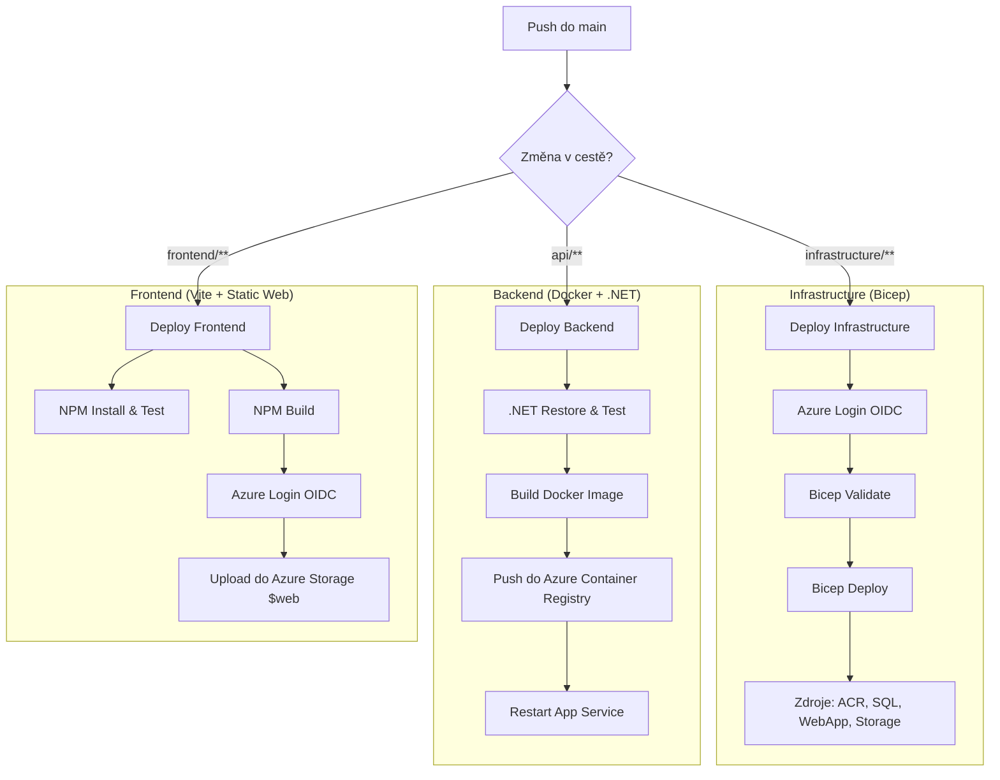

# 🏗️ Architektura Nasazení (CI/CD Pipeline)

Tento projekt využívá **GitHub Actions** pro automatizaci a **Azure Bicep** pro definici infrastruktury jako kódu (IaC).  
Celý proces je rozdělen do tří logických celků, které na sebe navazují.

---

## 🔄 Mermaid Diagram: Workflow Flow

Tento diagram ukazuje, co se stane po pushnutí kódu do větve `main`.



---

## 📘 Dokumentace Pipeline

### 1️⃣ Prerekvizity (Azure Setup)

Před prvním spuštěním nastav v GitHubu:

#### 🔐 Secrets

- `AZURE_CLIENT_ID` – Service Principal ID  
- `AZURE_TENANT_ID` – Tenant ID  
- `AZURE_SUBSCRIPTION_ID` – Subscription ID  
- `DB_PASSWORD` – Heslo pro SQL server  
- `JWT_SECRET` – Klíč pro podepisování tokenů  

#### ⚙️ Variables

- `ACR_NAME` – Název Container Registry  
- `VITE_API_URL` – URL backendu  

---

### 2️⃣ Infrastructure as Code (Bicep)

📁 `infrastructure/shared.bicep`

- Deklarativní definice infrastruktury
- Modulární struktura (networking, DB, monitoring)

⚠️ Poznámka:

Používá se:

```bicep
#disable-next-line BCEL-073
```

Důvod: Bicep linter někdy nezná `staticWebsite`, i když Azure API ho podporuje.

---

### 3️⃣ Backend CI/CD

- Každý push do `api/**`:
  - spustí unit testy
  - pokud projdou → build Docker image (`linux/amd64`)
- Image se uloží do ACR:
  - `latest`
  - unikátní SHA tag

🚀 Nasazení:
- běží v **App Service (B1 tier)**

---

### 4️⃣ Frontend CI/CD

- Node.js 20 + Vite build
- výstup: `dist/`

📦 Nasazení:
- upload do Azure Storage (`$web`)

🔐 Bezpečnost:
- používá OIDC:
```bash
--auth-mode login
```

➡️ žádné storage keys → menší pain + bezpečnější
