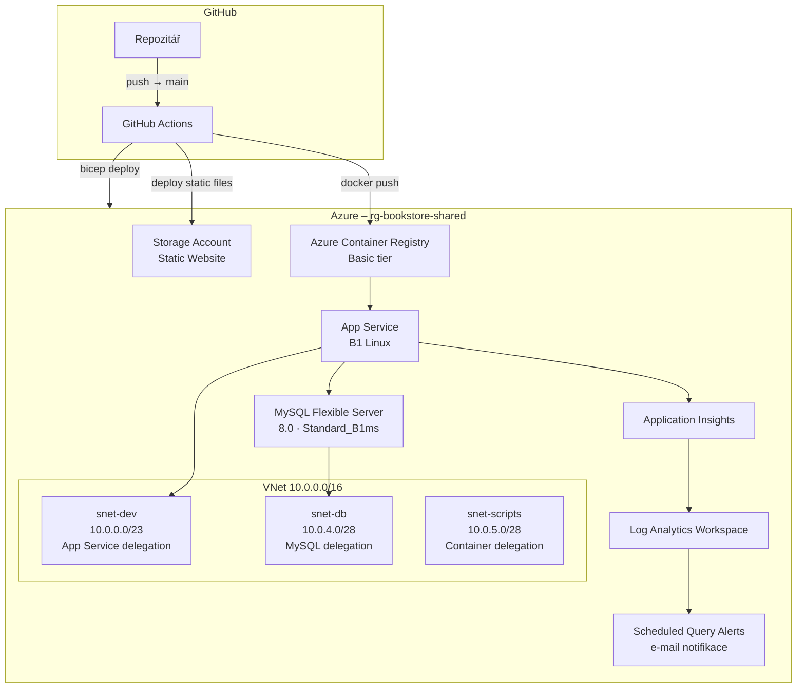
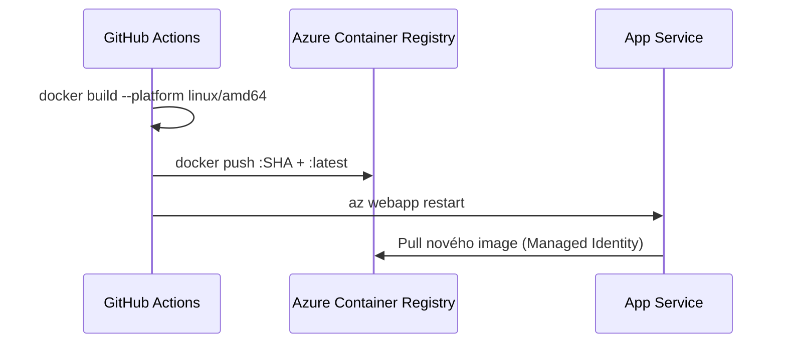
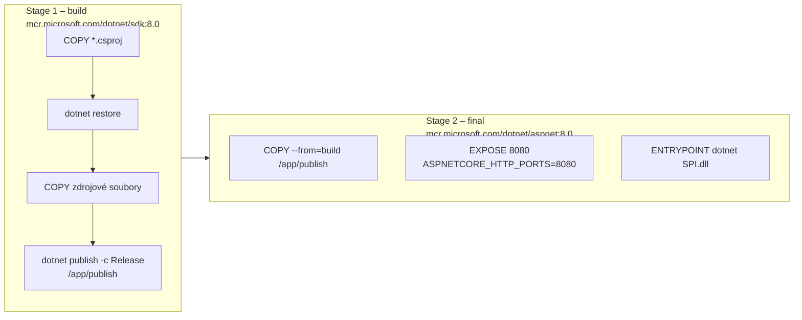
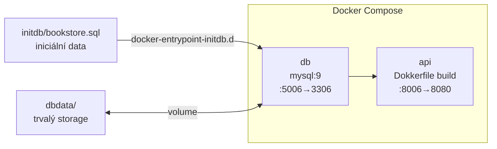

# Architektura nasazení

Projekt využívá **GitHub Actions** pro CI/CD a **Azure Bicep** pro infrastrukturu jako kód (IaC). Nasazení je rozděleno do tří nezávislých pipeline aktivovaných změnami v příslušných adresářích.

---

## Celkový přehled architektury



---

## CI/CD Pipeline – tok workflow

Každý push do větve `main` spustí pouze workflow odpovídající změněným souborům (path filters).

```mermaid
flowchart TD
    PUSH([git push → main])

    PUSH -->|"infrastructer/**"| WF_INFRA
    PUSH -->|"api/** · api.tests/**"| WF_BACK
    PUSH -->|"frontend/**"| WF_FRONT

    subgraph WF_INFRA["deploy-infra.yml"]
        I1[Azure Login OIDC] --> I2[az bicep build\nLint & Validate]
        I2 --> I3[az deployment group validate]
        I3 --> I4[azure/arm-deploy\nshared.bicep]
        I4 --> I5[Výpis výstupů\nFrontend URL · ACR Name]
    end

    subgraph WF_BACK["deploy-backend.yml"]
        B1[Setup .NET 8] --> B2[dotnet restore\ndotnet test]
        B2 --> B3[ReportGenerator\nCode Coverage]
        B3 --> B4[Azure Login OIDC]
        B4 --> B5[docker build\nlinux/amd64]
        B5 --> B6[docker push\nlatest + SHA tag]
        B6 --> B7[az webapp restart]
        B7 --> B8[k6 Load Test\n50s warm-up]
    end

    subgraph WF_FRONT["deploy-frontend.yml"]
        F1[Setup Node.js 20] --> F2[npm ci\nvitest --coverage]
        F2 --> F3[npm run build\nVITE_API_URL inject]
        F3 --> F4[Upload artifact\nfrontend-dist]
        F4 --> F5[Azure Login OIDC]
        F5 --> F6[az storage blob upload-batch\n→ \$web container]
        F6 --> F7[Lighthouse CI Audit\nPerf · Access · SEO]
    end
```



---

## Workflow 1 – Infrastruktura (`deploy-infra.yml`)

**Trigger:** push do `main` se změnou v `infrastructer/**` nebo `.github/workflows/deploy-infra.yml`.

| Job | Popis |
|---|---|
| `bicep-validate` | Přihlášení přes OIDC, `az bicep build` (lint), `az deployment group validate` (dry-run) |
| `bicep-deploy` | `azure/arm-deploy` nasadí `shared.bicep` do resource group `rg-bookstore-shared` |

**Parametry nasazení:**

```
prefix=psi
location=polandcentral
administratorLoginPassword=<secret: DB_PASSWORD>
jwtSecret=<secret: JWT_SECRET>
```

---

## Workflow 2 – Backend (`deploy-backend.yml`)

**Trigger:** push do `main` se změnou v `api/**`, `EFModels/**` nebo `api.tests/**`.

### Job: `test-backend`

1. Restore a test přes `dotnet test` s `XPlat Code Coverage`
2. Generování Markdown reportu pomocí `ReportGenerator` → přidáno do Job Summary

### Job: `deploy-backend`



### Job: `load-test-backend`

- Čeká 50 s na inicializaci kontejneru
- Spustí k6 zátěžový test ze souboru `api.tests/load-test.js`
- URL testovaného backendu pochází z výstupu předchozího jobu

---

## Workflow 3 – Frontend (`deploy-frontend.yml`)

**Trigger:** push do `main` se změnou v `frontend/**`.

### Job: `test-and-build`

1. `npm ci` + `npx vitest run --coverage`
2. `npm run build` s injekcí `VITE_API_URL` z GitHub Variables
3. Artefakt `frontend-dist` nahrán pro sdílení mezi joby

### Job: `deploy-frontend`

- Vyhledá Storage Account v resource group `rg-bookstore-shared`
- Povolí static website hosting (`--index-document index.html`, `--404-document index.html`)
- Nahraje build do `$web` containeru přes `az storage blob upload-batch`

### Job: `performance-audit`

- Spustí **Lighthouse CI** na nasazenou URL
- Výsledky skóre vypíše do Job Summary:

| Kategorie | Metrika |
|---|---|
| Performance | Skóre 0–100 |
| Accessibility | Skóre 0–100 |
| Best Practices | Skóre 0–100 |
| SEO | Skóre 0–100 |

---

## Dockerfile – multi-stage build



**Výsledný image** obsahuje pouze runtime (`aspnet:8.0`), bez SDK – minimální velikost a attack surface.

Závislosti zkopírované do image:
- `api/api/SPI.csproj` – hlavní projekt API
- `api/EFModels/EFModels.csproj` – Entity Framework modely

---

## Lokální vývoj (Docker Compose)

Soubor: `api/compose.yml`



Spuštění:

```bash
# z adresáře api/
docker compose up -d
```

Proměnné prostředí (`.env` nebo výchozí hodnoty):

| Proměnná | Výchozí hodnota |
|---|---|
| `MYSQL_ROOT_PASSWORD` | `your_mysql_password` |
| `JWT_SECRET_KEY` | `your_jwt_secret_key` |

---

## Prerekvizity a konfigurace

### GitHub Secrets

| Secret | Popis |
|---|---|
| `DB_PASSWORD` | Heslo pro MySQL administrátora (`mysqladmin`) |
| `JWT_SECRET` | Klíč pro podepisování JWT tokenů |

### GitHub Variables

| Variable | Popis |
|---|---|
| `AZURE_CLIENT_ID` | Client ID federované identity (OIDC) |
| `AZURE_TENANT_ID` | Azure Tenant ID |
| `AZURE_SUBSCRIPTION_ID` | Azure Subscription ID |
| `ACR_NAME` | Název Container Registry (bez `.azurecr.io`) |
| `VITE_API_URL` | Veřejná URL backendu pro frontend build |

### OIDC autentizace

Všechny tři workflow se přihlašují k Azure přes **Workload Identity Federation (OIDC)** – nevyžadují ukládání dlouhodobých secrets pro Azure. Permissions:

```yaml
permissions:
  id-token: write   # nutné pro OIDC token
  contents: read
```
- výstup: `dist/`

📦 Nasazení:
- upload do Azure Storage (`$web`)

🔐 Bezpečnost:
- používá OIDC:
```bash
--auth-mode login
```

➡️ žádné storage keys → menší pain + bezpečnější
