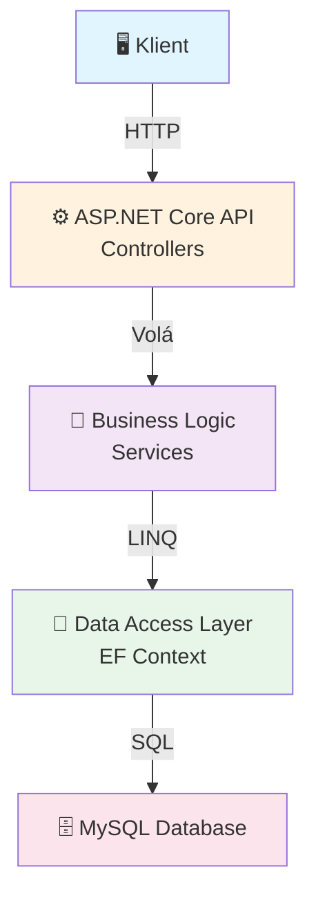
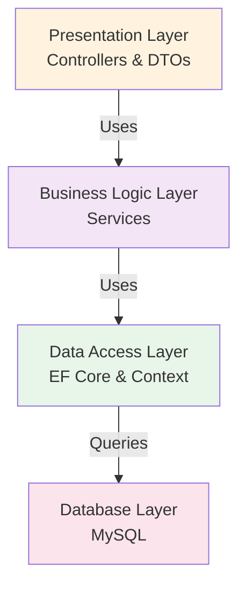
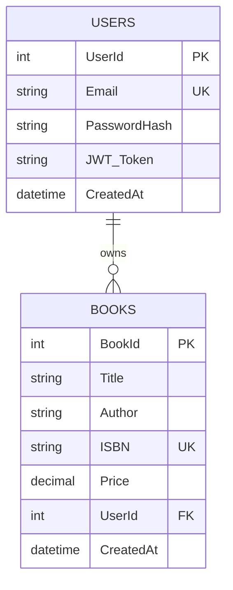

# PSI API - ASP.NET Core Backend

Modernní ASP.NET Core 8 API s Entity Framework, MySQL databází a JWT autentizací.

## 📋 Přehled

- **Framework:** ASP.NET Core 8
- **Database:** MySQL 8
- **ORM:** Entity Framework Core
- **Autentizace:** JWT
- **Containerization:** Docker & Docker Compose

## 📂 Struktura Projektu

```
api/
├── api/                           # Hlavní ASP.NET Core projekt
│   ├── Controllers/              # API Controllery
│   ├── Services/                 # Business Logic Services
│   ├── Models/                   # Request/Response modely
│   ├── DTO/                      # Data Transfer Objects
│   ├── Data/                     # Data access layer
│   ├── Program.cs                # Konfigurace aplikace
│   ├── SPI.csproj               # Project file
│   ├── appsettings.json         # Nastavení
│   └── SPI.http                 # HTTP testy
├── EFModels/                     # Entity Framework modely
├── Dockerfile                    # Docker image
├── compose.yml                   # Docker Compose
├── Makefile                      # Build příkazy
└── README.md                     # Tato dokumentace
```

## 🏗️ Architektura



## 🏛️ Vrstvená Architektura



## 🗄️ Datový Model



## ⚙️ Instalace a Setup

### Požadavky

- **.NET 8 SDK** - [Stažení](https://dotnet.microsoft.com/download)
- **MySQL 8** - [Stažení](https://dev.mysql.com/downloads/mysql/) nebo Docker
- **Git**

### Kroky Instalace

1. **Klonuj repository:**
```bash
git clone https://github.com/matejhauschwitz/PSI.git
cd PSI/api
```

2. **Nastav environment proměnné:**
```bash
cp .env.example .env
```

Uprav `.env` soubor:
```env
JWT_SECRET_KEY=tvuj_tajny_klic_zde
MYSQL_ROOT_PASSWORD=tvoje_heslo_zde
```

3. **Spusť MySQL (Docker):**
```bash
docker compose up -d
```

4. **Obnov NuGet balíčky:**
```bash
dotnet restore
```

5. **Spusť migraci databáze:**
```bash
cd api
dotnet ef database update
```

## ▶️ Spuštění Aplikace

### Možnost 1: Lokální Development

```bash
cd api/api
dotnet run
```

API bude dostupná na: `https://localhost:5118`

### Možnost 2: S Make (Linux/Mac)

```bash
make dev        # Spustí všechno (Docker + Backend + Frontend)
make backend    # Jen backend
make docker     # Jen MySQL kontejner
```

### Možnost 3: Docker Compose

```bash
docker compose up --build
```

## 🔌 API Endpoints

### Authentication

```http
POST /api/auth/register
Content-Type: application/json

{
  "email": "user@example.com",
  "password": "SecurePassword123"
}
```

```http
POST /api/auth/login
Content-Type: application/json

{
  "email": "user@example.com",
  "password": "SecurePassword123"
}
```

### Books Management

```http
GET /api/books
Authorization: Bearer {token}
```

```http
POST /api/books
Authorization: Bearer {token}
Content-Type: application/json

{
  "title": "Název Knihy",
  "author": "Autor",
  "isbn": "978-3-16-148410-0",
  "price": 299.99
}
```

```http
GET /api/books/{id}
Authorization: Bearer {token}
```

```http
PUT /api/books/{id}
Authorization: Bearer {token}
Content-Type: application/json

{
  "title": "Nový Název",
  "author": "Nový Autor",
  "isbn": "978-3-16-148410-0",
  "price": 349.99
}
```

```http
DELETE /api/books/{id}
Authorization: Bearer {token}
```

## 🔐 JWT Autentizace

### Jak Funguje

1. Uživatel se registruje nebo přihlásí
2. Server vytvoří JWT token obsahující:
   - User ID
   - Email
   - Expiration time
3. Klient zašle token v `Authorization: Bearer {token}` headeru
4. Server token validuje a zpracovává požadavek

### Nastavení

V `appsettings.json`:
```json
{
  "Jwt": {
    "SecretKey": "tvuj_tajny_klic_min_32_znaku",
    "Issuer": "PSI.API",
    "Audience": "PSI.Client",
    "ExpirationMinutes": 1440
  }
}
```

## 💻 Development

### Vytvoření Nového Controlleru

```bash
cd api
dotnet new controller -n Books -o Controllers
```

```csharp
[ApiController]
[Route("api/[controller]")]
[Authorize]
public class BooksController : ControllerBase
{
    private readonly IBookService _service;
    
    public BooksController(IBookService service)
    {
        _service = service;
    }
    
    [HttpGet]
    public async Task<IActionResult> GetAll()
    {
        var books = await _service.GetAllAsync();
        return Ok(books);
    }
}
```

### Vytvoření Service

```csharp
public interface IBookService
{
    Task<IEnumerable<BookDto>> GetAllAsync();
    Task<BookDto> GetByIdAsync(int id);
    Task CreateAsync(CreateBookDto dto);
}

public class BookService : IBookService
{
    private readonly ApiDbContext _context;
    
    public BookService(ApiDbContext context)
    {
        _context = context;
    }
    
    public async Task<IEnumerable<BookDto>> GetAllAsync()
    {
        return await _context.Books
            .Select(b => new BookDto { ... })
            .ToListAsync();
    }
}
```

### Registrace v Program.cs

```csharp
builder.Services.AddScoped<IBookService, BookService>();
```

### Hot Reload Development

Při změně kódu:
```bash
dotnet watch run
```

Aplikace se automaticky restartuje.

## 🐳 Docker

### Build Image

```bash
docker build -t psi-api:latest .
```

### Run Container

```bash
docker run -p 8080:8080 \
  -e JWT_SECRET_KEY=your_secret \
  -e MYSQL_CONNECTION=your_connection_string \
  psi-api:latest
```

### Docker Compose

```yaml
services:
  mysql:
    image: mysql:8
    environment:
      MYSQL_ROOT_PASSWORD: ${MYSQL_ROOT_PASSWORD}
    ports:
      - "5006:3306"
    volumes:
      - mysql_data:/var/lib/mysql
      - ./initdb:/docker-entrypoint-initdb.d

  api:
    build: .
    ports:
      - "8080:8080"
    environment:
      JWT_SECRET_KEY: ${JWT_SECRET_KEY}
      ConnectionStrings__DefaultConnection: "Server=mysql;Port=3306;Database=PSI;User=root;Password=${MYSQL_ROOT_PASSWORD};"
    depends_on:
      - mysql

volumes:
  mysql_data:
```

## 🗂️ Entity Framework Migrations

### Vytvoření Migration

```bash
cd api
dotnet ef migrations add AddBookTable
```

### Aplikace Migration

```bash
dotnet ef database update
```

### Smazání Poslední Migration

```bash
dotnet ef migrations remove
```

### View SQL

```bash
dotnet ef migrations script --idempotent
```

## 🧪 Testování

### HTTP Testing v VS Code

Instaluj rozšíření "REST Client" a použ `SPI.http`:

```http
### Registrace
POST https://localhost:5118/api/auth/register
Content-Type: application/json

{
  "email": "test@example.com",
  "password": "Test123!"
}

### Přihlášení
POST https://localhost:5118/api/auth/login
Content-Type: application/json

{
  "email": "test@example.com",
  "password": "Test123!"
}

### Získání Knih
GET https://localhost:5118/api/books
Authorization: Bearer {{token}}
```

### Unit Testing

```csharp
[TestClass]
public class BookServiceTests
{
    private IBookService _service;
    private Mock<ApiDbContext> _contextMock;
    
    [TestInitialize]
    public void Setup()
    {
        _contextMock = new Mock<ApiDbContext>();
        _service = new BookService(_contextMock.Object);
    }
    
    [TestMethod]
    public async Task GetAllAsync_ReturnsBooks()
    {
        // Arrange
        var books = new List<Book> { new Book { Id = 1, Title = "Test" } };
        
        // Act
        var result = await _service.GetAllAsync();
        
        // Assert
        Assert.AreEqual(1, result.Count());
    }
}
```

## 🔄 CI/CD

Projekt podporuje GitHub Actions pro automatické testy a deployment.

Zkontroluj `.github/workflows/` pro konfiguraci.

## 📚 Konfigurace

### appsettings.json

```json
{
  "Logging": {
    "LogLevel": {
      "Default": "Information",
      "Microsoft": "Warning"
    }
  },
  "Jwt": {
    "SecretKey": "your-secret-key-min-32-characters",
    "Issuer": "PSI.API",
    "Audience": "PSI.Client",
    "ExpirationMinutes": 1440
  },
  "ConnectionStrings": {
    "DefaultConnection": "Server=localhost;Port=3306;Database=PSI;User=root;Password=password;"
  },
  "AllowedHosts": "*"
}
```

### appsettings.Development.json

```json
{
  "Logging": {
    "LogLevel": {
      "Default": "Debug"
    }
  }
}
```

## 🚀 Deployment

### Na Azure

1. Vytvoř Azure App Service
2. Pushni na Azure Container Registry
3. Deployuj container
4. Nastav environment proměnné

### Na Vlastní Server

1. Instaluj .NET Runtime
2. Instaluj MySQL
3. Zkopíruj published aplikaci
4. Nastav systemd service
5. Spusť `dotnet SPI.dll`

## 📖 Užitečné Příkazy

```bash
# Zobrazit verzi .NET
dotnet --version

# Vyčistit build
dotnet clean

# Publish pro production
dotnet publish -c Release

# Spustit testy
dotnet test

# Restore balíčků
dotnet restore

# Přidej NuGet balíček
dotnet add package PackageName

# Spusť dev server s hot reload
dotnet watch run
```

## 🌐 Frontend Integrace

Frontend komunikuje s API na `https://localhost:5118` (development).

### CORS Nastavení

V `Program.cs`:
```csharp
builder.Services.AddCors(options =>
{
    options.AddPolicy("AllowFrontend", policy =>
        policy.WithOrigins("http://localhost:3000")
              .AllowAnyMethod()
              .AllowAnyHeader());
});

app.UseCors("AllowFrontend");
```

## 🔧 Časté Úkoly

### Přidání Nového Endpointu

1. Vytvoř nový Controller nebo přidej metodu do existujícího
2. Vytvř DTO pro request/response
3. Vytvoř Service logiku
4. Proveď migraci databáze (pokud třeba)
5. Otestuj s REST Clientem

### Resetování Databáze

```bash
cd api
dotnet ef database drop --force
dotnet ef database update
```

### Debugování

```bash
# Spusť s debuggerem
dotnet run --no-build

# Vlož breakpoint a přidej debug output
System.Diagnostics.Debug.WriteLine($"Debug: {value}");
```

## 📝 Poznámky

- Token expiruje za 24 hodin (nastavitelné)
- Všechny hesla jsou hashovaná (BCrypt)
- API validuje všechny inputy
- CORS je nakonfigurován pro frontend na portu 3000

## Rychlý Start

```bash
# 1. Naklonuj a vstup
git clone https://github.com/matejhauschwitz/PSI.git
cd PSI/api

# 2. Nastav env
cp .env.example .env

# 3. Spusť MySQL
docker compose up -d

# 4. Migruj DB
cd api && dotnet ef database update

# 5. Spusť API
dotnet run

# Hotovo! API je na https://localhost:5118
```

---

**Poslední aktualizace:** 2026-05-04
