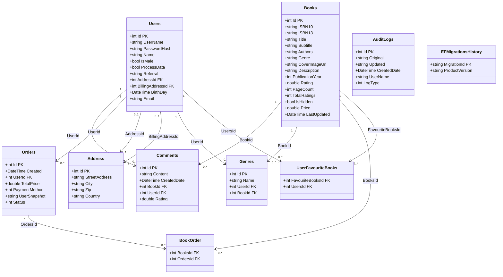

```mermaid
classDiagram
    class Users {
        +int Id PK
        +string UserName
        +string PasswordHash
        +string Name
        +bool IsMale
        +bool ProcessData
        +string Referral
        +int AddressId FK
        +int BillingAddressId FK
        +DateTime BirthDay
        +string Email
    }

    class Address {
        +int Id PK
        +string StreetAddress
        +string City
        +string Zip
        +string Country
    }

    class Books {
        +int Id PK
        +string ISBN10
        +string ISBN13
        +string Title
        +string Subtitle
        +string Authors
        +string Genre
        +string CoverImageUrl
        +string Description
        +int PublicationYear
        +double Rating
        +int PageCount
        +int TotalRatings
        +bool IsHidden
        +double Price
        +DateTime LastUpdated
    }

    class Comments {
        +int Id PK
        +string Content
        +DateTime CreatedDate
        +int BookId FK
        +int UserId FK
        +double Rating
    }

    class Genres {
        +int Id PK
        +string Name
        +int UserId FK
        +int BookId FK
    }

    class Orders {
        +int Id PK
        +DateTime Created
        +int UserId FK
        +double TotalPrice
        +int PaymentMethod
        +string UserSnapshot
        +int Status
    }

    class AuditLogs {
        +int Id PK
        +string Original
        +string Updated
        +DateTime CreatedDate
        +string UserName
        +int LogType
    }

    class EFMigrationsHistory {
        +string MigrationId PK
        +string ProductVersion
    }

    class BookOrder {
        +int BooksId FK
        +int OrdersId FK
    }

    class UserFavouriteBooks {
        +int FavouriteBooksId FK
        +int UsersId FK
    }

    Users "1" --> "0..*" Comments : UserId
    Books "1" --> "0..*" Comments : BookId

    Users "1" --> "0..*" Orders : UserId

    Users "0..1" --> "1" Address : AddressId
    Users "0..1" --> "1" Address : BillingAddressId

    Users "1" --> "0..*" Genres : UserId
    Books "1" --> "0..*" Genres : BookId

    Books "1" --> "0..*" BookOrder : BooksId
    Orders "1" --> "0..*" BookOrder : OrdersId

    Users "1" --> "0..*" UserFavouriteBooks : UsersId
    Books "1" --> "0..*" UserFavouriteBooks : FavouriteBooksId
```
