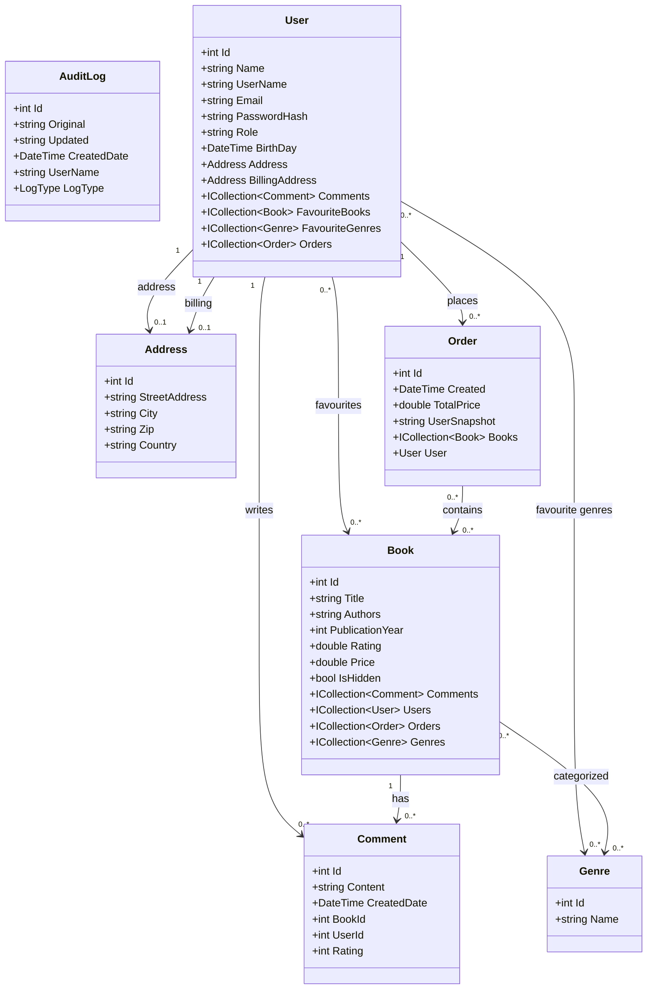

```mermaid
classDiagram

    class Address {
        +int Id
        +string StreetAddress
        +string City
        +string Zip
        +string Country
    }

    class AuditLog {
        +int Id
        +string Original
        +string Updated
        +DateTime CreatedDate
        +string UserName
        +LogType LogType
    }

    class Book {
        +int Id
        +string Title
        +string Authors
        +int PublicationYear
        +double Rating
        +double Price
        +bool IsHidden
        +ICollection~Comment~ Comments
        +ICollection~User~ Users
        +ICollection~Order~ Orders
        +ICollection~Genre~ Genres
    }

    class Comment {
        +int Id
        +string Content
        +DateTime CreatedDate
        +int BookId
        +int UserId
        +int Rating
    }

    class Genre {
        +int Id
        +string Name
    }

    class Order {
        +int Id
        +DateTime Created
        +double TotalPrice
        +string UserSnapshot
        +ICollection~Book~ Books
        +User User
    }

    class User {
        +int Id
        +string Name
        +string UserName
        +string Email
        +string PasswordHash
        +string Role
        +DateTime BirthDay
        +Address Address
        +Address BillingAddress
        +ICollection~Comment~ Comments
        +ICollection~Book~ FavouriteBooks
        +ICollection~Genre~ FavouriteGenres
        +ICollection~Order~ Orders
    }

    %% Relationships

    User "1" --> "0..*" Comment : writes
    Book "1" --> "0..*" Comment : has

    User "0..*" --> "0..*" Book : favourites
    User "0..*" --> "0..*" Genre : favourite genres

    Book "0..*" --> "0..*" Genre : categorized

    Order "0..*" --> "0..*" Book : contains
    User "1" --> "0..*" Order : places

    User "1" --> "0..1" Address : address
    User "1" --> "0..1" Address : billing
```
