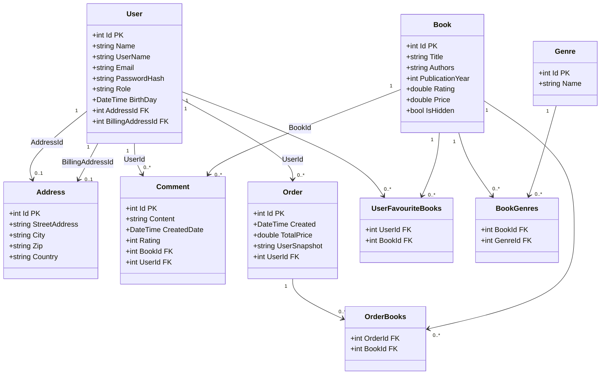

```mermaid
classDiagram
    class User {
        +int Id PK
        +string Name
        +string UserName
        +string Email
        +string PasswordHash
        +string Role
        +DateTime BirthDay
        +int AddressId FK
        +int BillingAddressId FK
    }

    class Address {
        +int Id PK
        +string StreetAddress
        +string City
        +string Zip
        +string Country
    }

    class Book {
        +int Id PK
        +string Title
        +string Authors
        +int PublicationYear
        +double Rating
        +double Price
        +bool IsHidden
    }

    class Comment {
        +int Id PK
        +string Content
        +DateTime CreatedDate
        +int Rating
        +int BookId FK
        +int UserId FK
    }

    class Genre {
        +int Id PK
        +string Name
    }

    class Order {
        +int Id PK
        +DateTime Created
        +double TotalPrice
        +string UserSnapshot
        +int UserId FK
    }

    %% JOIN TABLES (důležité pro DB!)

    class UserFavouriteBooks {
        +int UserId FK
        +int BookId FK
    }

    class BookGenres {
        +int BookId FK
        +int GenreId FK
    }

    class OrderBooks {
        +int OrderId FK
        +int BookId FK
    }

    %% Relationships (relační pohled)

    User "1" --> "0..*" Comment : UserId
    Book "1" --> "0..*" Comment : BookId

    User "1" --> "0..*" Order : UserId

    User "1" --> "0..1" Address : AddressId
    User "1" --> "0..1" Address : BillingAddressId

    %% M:N přes join tabulky
    User "1" --> "0..*" UserFavouriteBooks
    Book "1" --> "0..*" UserFavouriteBooks

    Book "1" --> "0..*" BookGenres
    Genre "1" --> "0..*" BookGenres

    Order "1" --> "0..*" OrderBooks
    Book "1" --> "0..*" OrderBooks
```
