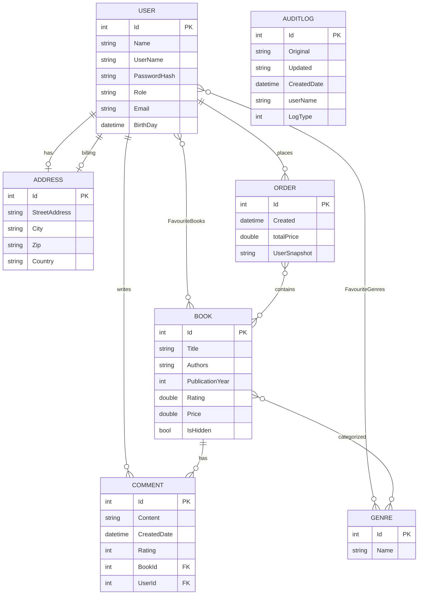

```mermaid
erDiagram
  USER {
        int Id PK
        string Name
        string UserName
        string PasswordHash
        string Role
        string Email
        datetime BirthDay
    }

    ADDRESS {
        int Id PK
        string StreetAddress
        string City
        string Zip
        string Country
    }

    BOOK {
        int Id PK
        string Title
        string Authors
        int PublicationYear
        double Rating
        double Price
        bool IsHidden
    }

    COMMENT {
        int Id PK
        string Content
        datetime CreatedDate
        int Rating
        int BookId FK
        int UserId FK
    }

    GENRE {
        int Id PK
        string Name
    }

    ORDER {
        int Id PK
        datetime Created
        double totalPrice
        string UserSnapshot
    }

    AUDITLOG {
        int Id PK
        string Original
        string Updated
        datetime CreatedDate
        string userName
        int LogType
    }

    %% Relationships

    USER ||--o{ COMMENT : writes
    BOOK ||--o{ COMMENT : has

    USER }o--o{ BOOK : FavouriteBooks

    USER }o--o{ GENRE : FavouriteGenres

    BOOK }o--o{ GENRE : categorized

    ORDER }o--o{ BOOK : contains

    USER ||--o{ ORDER : places

    USER ||--o| ADDRESS : has
    USER ||--o| ADDRESS : billing
```
