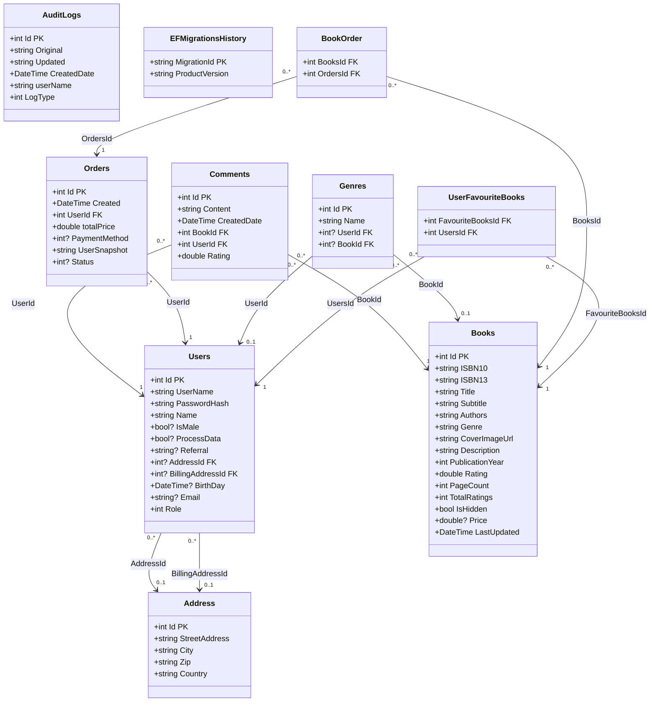

```mermaid
classDiagram
    class Users {
        +int Id PK
        +string UserName
        +string PasswordHash
        +string Name
        +bool? IsMale
        +bool? ProcessData
        +string? Referral
        +int? AddressId FK
        +int? BillingAddressId FK
        +DateTime? BirthDay
        +string? Email
        +int Role
    }

    class Address {
        +int Id PK
        +string StreetAddress
        +string City
        +string Zip
        +string Country
    }

    class Books {
        +int Id PK
        +string ISBN10
        +string ISBN13
        +string Title
        +string Subtitle
        +string Authors
        +string Genre
        +string CoverImageUrl
        +string Description
        +int PublicationYear
        +double Rating
        +int PageCount
        +int TotalRatings
        +bool IsHidden
        +double? Price
        +DateTime LastUpdated
    }

    class Comments {
        +int Id PK
        +string Content
        +DateTime CreatedDate
        +int BookId FK
        +int UserId FK
        +double Rating
    }

    class Genres {
        +int Id PK
        +string Name
        +int? UserId FK
        +int? BookId FK
    }

    class Orders {
        +int Id PK
        +DateTime Created
        +int UserId FK
        +double totalPrice
        +int? PaymentMethod
        +string UserSnapshot
        +int? Status
    }

    class AuditLogs {
        +int Id PK
        +string Original
        +string Updated
        +DateTime CreatedDate
        +string userName
        +int LogType
    }

    class EFMigrationsHistory {
        +string MigrationId PK
        +string ProductVersion
    }

    class BookOrder {
        +int BooksId FK
        +int OrdersId FK
    }

    class UserFavouriteBooks {
        +int FavouriteBooksId FK
        +int UsersId FK
    }

    Comments "0..*" --> "1" Users : UserId
    Comments "0..*" --> "1" Books : BookId

    Orders "0..*" --> "1" Users : UserId

    Users "0..*" --> "0..1" Address : AddressId
    Users "0..*" --> "0..1" Address : BillingAddressId

    Genres "0..*" --> "0..1" Users : UserId
    Genres "0..*" --> "0..1" Books : BookId

    BookOrder "0..*" --> "1" Books : BooksId
    BookOrder "0..*" --> "1" Orders : OrdersId

    UserFavouriteBooks "0..*" --> "1" Books : FavouriteBooksId
    UserFavouriteBooks "0..*" --> "1" Users : UsersId
```
