# Frontend – Dokumentace

Frontend e-commerce aplikace pro prodej knih. Postaven na **React 18 + TypeScript + Vite**, stylovaný pomocí **Tailwind CSS**.

---

## Technologický stack

| Technologie | Verze | Účel |
|---|---|---|
| React | 18 | UI framework |
| TypeScript | 5 (strict) | Typová bezpečnost |
| Vite | 5 | Build tool, dev server (port 3000) |
| React Router | 6 | Klientské routování |
| Tailwind CSS | 3 | Utility-first styling |
| Axios | 1.6 | HTTP klient |
| Lucide React | – | SVG ikony |
| React Hot Toast | 2.6 | Toast notifikace |
| Vitest + RTL | 4 | Unit a integration testy |

---

## Spuštění

```bash
# Instalace závislostí
npm install

# Dev server (http://localhost:3000)
npm run dev

# Produkční build
npm run build

# Testy
npm test

# Testy s coverage reportem
npm run coverage
```

Proměnná prostředí:

```
VITE_API_URL=https://<backend-url>   # výchozí: http://localhost:5118
```

---

## Struktura projektu

```
frontend/
├── index.html                  # HTML vstupní bod (lang=cs, title "Knihorny")
├── vite.config.ts              # Vite + Vitest konfigurace
├── tsconfig.json               # TypeScript (strict, ES2020, react-jsx)
├── tailwind.config.js          # Tailwind – content scan
├── postcss.config.js           # PostCSS – tailwindcss + autoprefixer
├── package.json
└── src/
    ├── main.tsx                # React.StrictMode → <App />
    ├── App.tsx                 # Router, auth guard, routes
    ├── index.css               # Tailwind directives + custom utilities
    ├── env.d.ts                # Vite env type declaration
    ├── types/index.ts          # Sdílené TypeScript interfaces
    ├── test/setup.ts           # Vitest setup (jest-dom, cleanup)
    ├── context/
    │   └── CartContext.tsx     # Globální stav košíku (localStorage)
    ├── hooks/                  # Custom React hooks
    ├── services/               # API komunikace (Axios)
    ├── pages/                  # Page-level komponenty
    └── components/             # Reusable UI komponenty
```

---

## Architektura aplikace

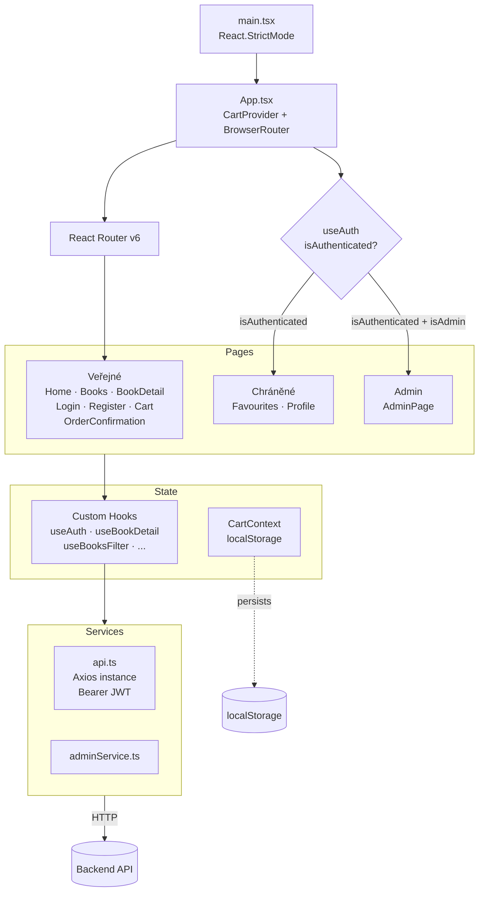

---

## Routování

Definováno v [src/App.tsx](src/App.tsx). Chráněné routy přesměrovávají na `/login`.

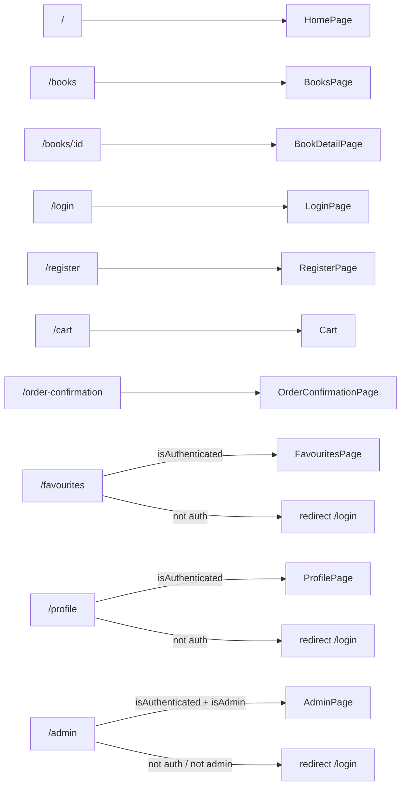

---

## Datové typy (`src/types/index.ts`)

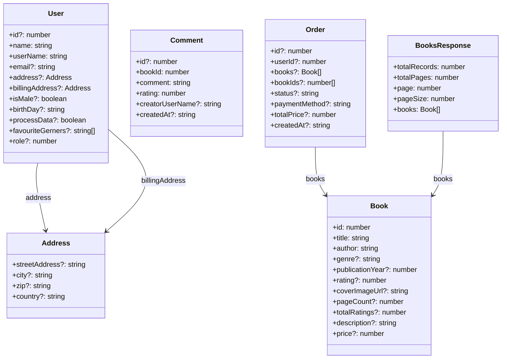

---

## Stav košíku (`CartContext`)

Soubor: [src/context/CartContext.tsx](src/context/CartContext.tsx)

Ukládá košík do `localStorage` a obnoví ho při načtení stránky.

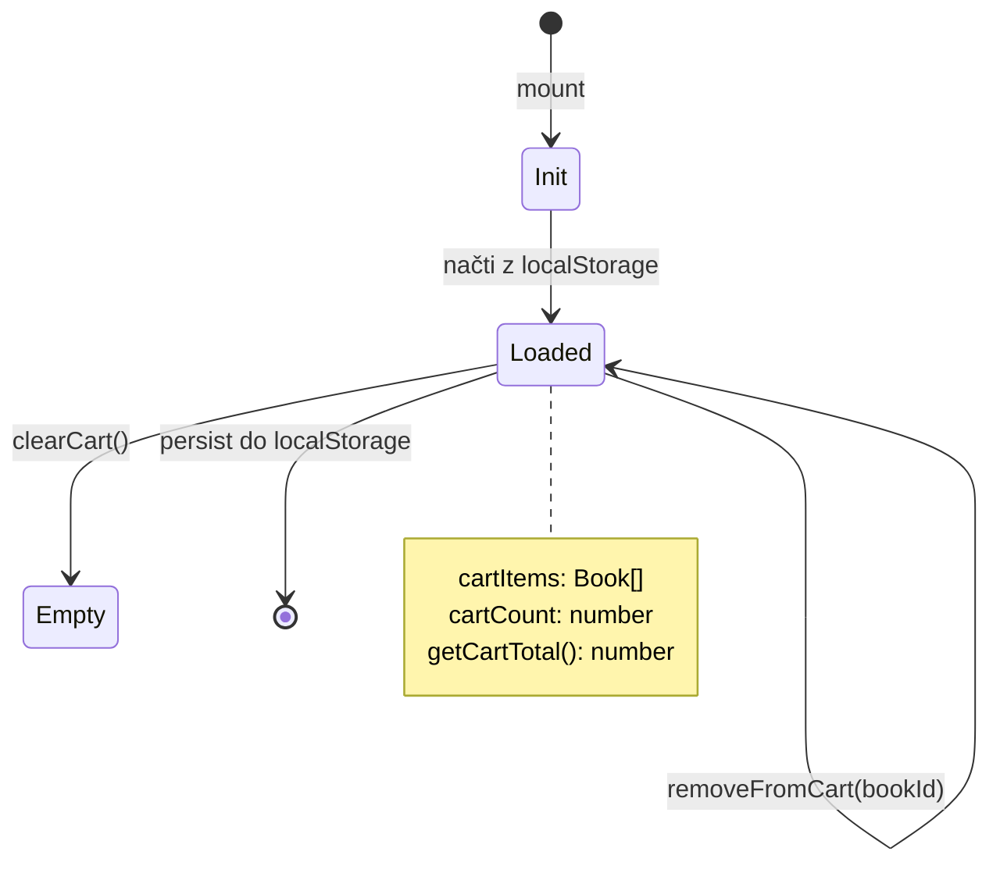

---

## Hooky (`src/hooks/`)

| Hook | Popis |
|---|---|
| `useAuth` | Inicializuje auth stav z JWT v localStorage; rozlišuje role (0=user, 1=admin) |
| `useBookDetail` | Načte detail knihy + komentáře + stav oblíbené; exponuje toggle a addComment |
| `useBooksFilter` | Stránkovaný seznam knih s filtry (title, genre, cenové rozmezí) |
| `useFavourites` | Načte oblíbené; optimistické odebrání položky |
| `useFeaturedBooks` | Načte prvních 50 knih a vrátí top 6 dle ratingu |
| `useHomeStats` | Paralelně načte statistiky (knihy, žánry, uživatelé, bestseller) pro úvodní stránku |

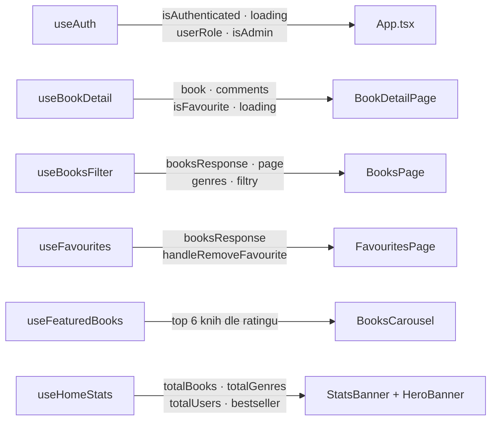

---

## Services (`src/services/`)

### `api.ts`

Centrální Axios instance s automatickým přidáváním JWT tokenu:

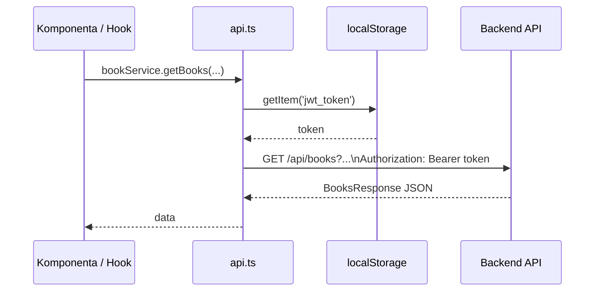

| Service | Metody |
|---|---|
| `authService` | `register(user)` · `login(credentials)` → uloží JWT · `logout()` → smaže JWT · `isAuthenticated()` |
| `bookService` | `getBooks(page, pageSize, title, genre, minPrice, maxPrice)` · `getGenres()` · `getBook(id)` · `getFavourites()` · `addFavourite(id)` · `removeFavourite(id)` |
| `userService` | `getUserDetail()` · `updateUser(user)` |
| `commentService` | `getComments(bookId)` · `addComment(comment)` |
| `orderService` | `createOrder(order)` · `getOrders()` |

### `adminService.ts`

CRUD operace dostupné pouze administrátorům:

| Oblast | Metody |
|---|---|
| Users | `getUsers()` · `createUser(user)` · `updateUser(id, user)` · `deleteUser(id)` |
| Orders | `getOrders()` · `updateOrderStatus(id, status)` · `deleteOrder(id)` |
| Books | `getBooks()` · `createBook(book)` · `updateBook(id, book)` · `deleteBook(id)` |
| Audit logs | `getAuditLogs(logType?, userName?, startDate?, endDate?)` |

---

## Stránky (`src/pages/`)

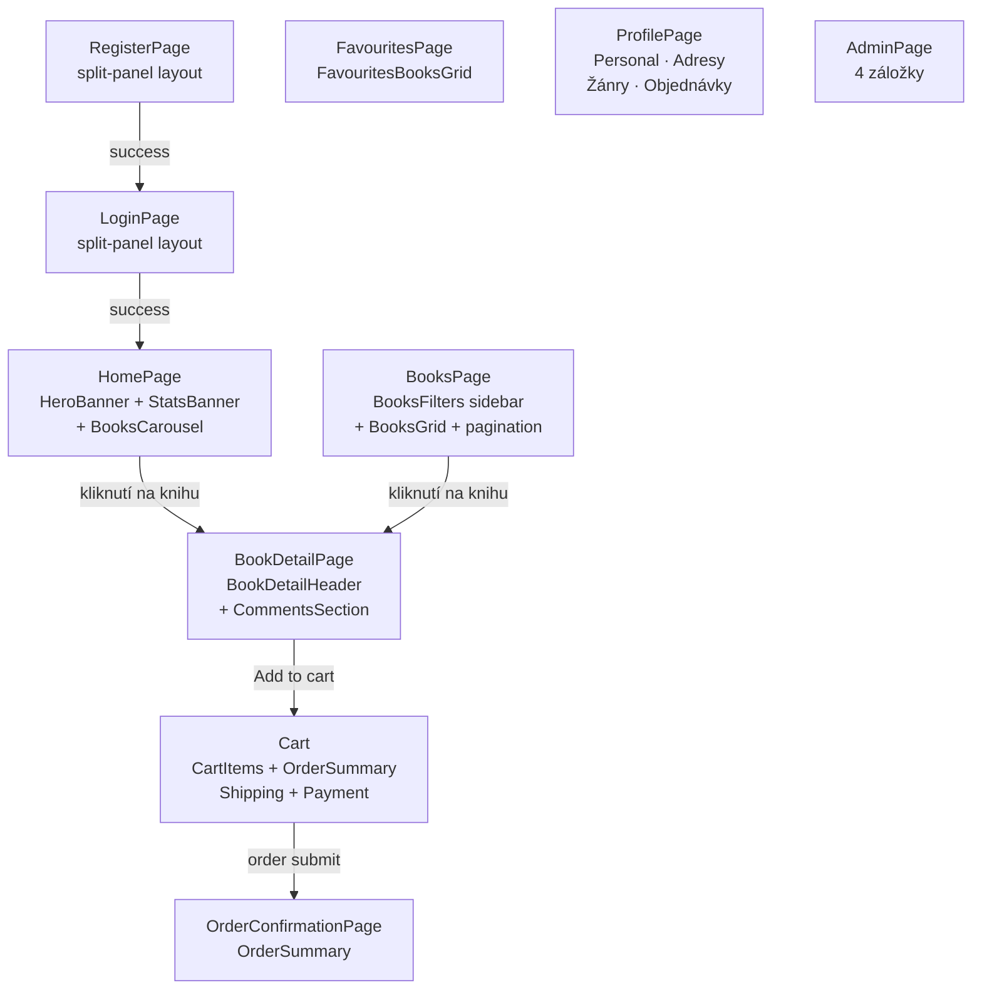

### AdminPage – záložky

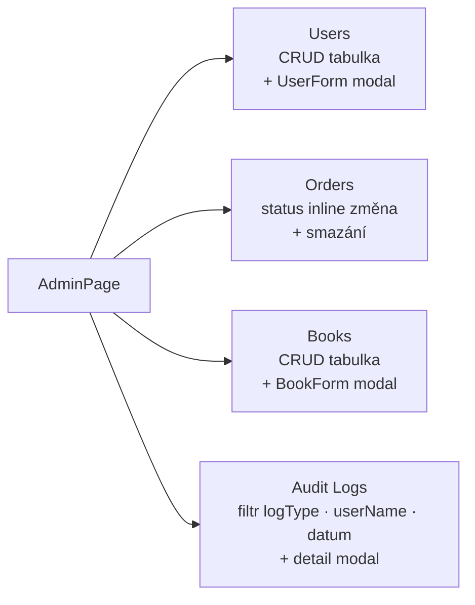

### ProfilePage – sekce

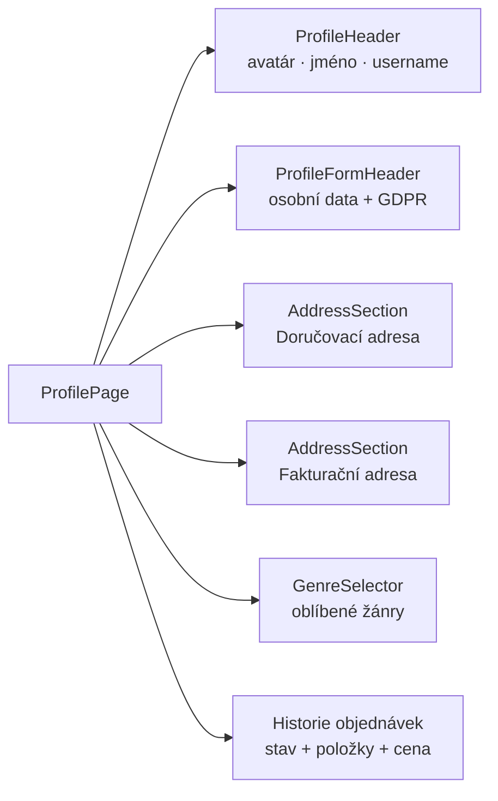

---

## Komponenty (`src/components/`)

### Navigace a layout

| Komponenta | Popis |
|---|---|
| `Navbar` | Sticky top navbar; auth-conditional linky (Oblíbené, Profil, Admin); badge s počtem položek v košíku |
| `Modal` | Generický accessible modal; zavírání přes ESC; konfigurovatelná šířka |

### Úvodní stránka

| Komponenta | Popis |
|---|---|
| `HeroBanner` | Full-width hero; tmavý levý panel + přebal bestselleru vpravo; CTA reagují na přihlášení |
| `StatsBanner` | 3 sloupce: celkem knih · žánrů · uživatelů |
| `BooksCarousel` | Responsivní karusel top-rated knih; breakpointy: 1 / 2 / 4 knih |

### Katalog knih

| Komponenta | Popis |
|---|---|
| `BooksGrid` | Mřížka karet knih; kompaktní paginator (prev · čísla stránek · next) |
| `BooksFilters` | Sidebar: fulltext search · seznam žánrů s vyhledáváním · min/max cena |

### Detail knihy

| Komponenta | Popis |
|---|---|
| `BookDetailHeader` | Přebal + metadata + cena + tlačítka košík / oblíbené |
| `CommentsSection` | Seznam recenzí s hvězdičkovým hodnocením; formulář pro přidání (jen přihlášení) |
| `FavouritesBooksGrid` | Mřížka oblíbených; hover odhalí tlačítko pro odebrání |

### Checkout

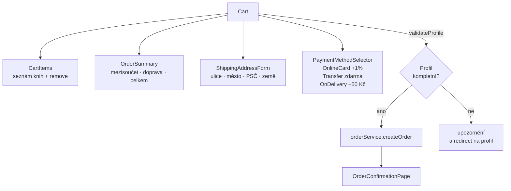

### Profil a admin formuláře

| Komponenta | Popis |
|---|---|
| `ProfileHeader` | Avatar (iniciály) + jméno + username + e-mail |
| `ProfileFormHeader` | Osobní data: jméno, e-mail, pohlaví, narozeniny, GDPR souhlas |
| `AddressField` | Jeden popsaný textový input pro adresní pole |
| `AddressSection` | Karta se 4× `AddressField` (doručovací / fakturační adresa) |
| `GenreSelector` | Tag-cloud přepínatelných žánrů; vybrané = modrá výplň |
| `UserForm` | Admin formulář: create/edit user (username, jméno, e-mail, heslo při vytváření, role) |
| `BookForm` | Admin formulář: create/edit book (title, subtitle, autor, žánr, popis, ISBN10/13, cover URL, cena) |

---

## Testování

Každá stránka a většina komponent mají vlastní `.test.tsx` soubor vedle zdrojového souboru. Testy jsou psány pomocí **Vitest + React Testing Library**.

### Coverage prahy (`vite.config.ts`)

| Metrika | Práh |
|---|---|
| Lines | 90 % |
| Functions | 90 % |
| Statements | 90 % |
| Branches | 80 % |

Z coverage jsou vyloučeny: `main.tsx`, `vite-env.d.ts`, `src/types/**`, testovací soubory, `index.css`.

Coverage reporty: `text` (terminal) · `json` · `html` · `cobertura` (pro CI).

Setup soubor [`src/test/setup.ts`](src/test/setup.ts) registruje `@testing-library/jest-dom` matchers a po každém testu volá `cleanup()`.

---

## Autentizace a autorizace

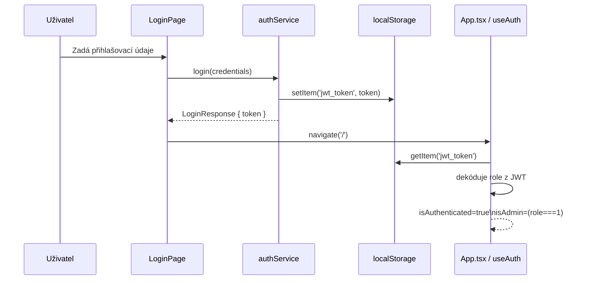

JWT token je ukládán do `localStorage` pod klíčem `jwt_token`. Request interceptor v `api.ts` ho automaticky přidává do každého požadavku jako `Authorization: Bearer <token>`. Odhlášení (`authService.logout()`) token z localStorage odstraní.

