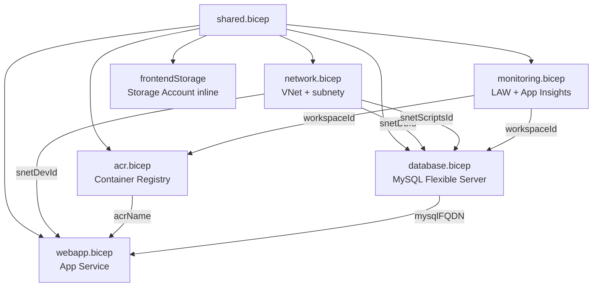
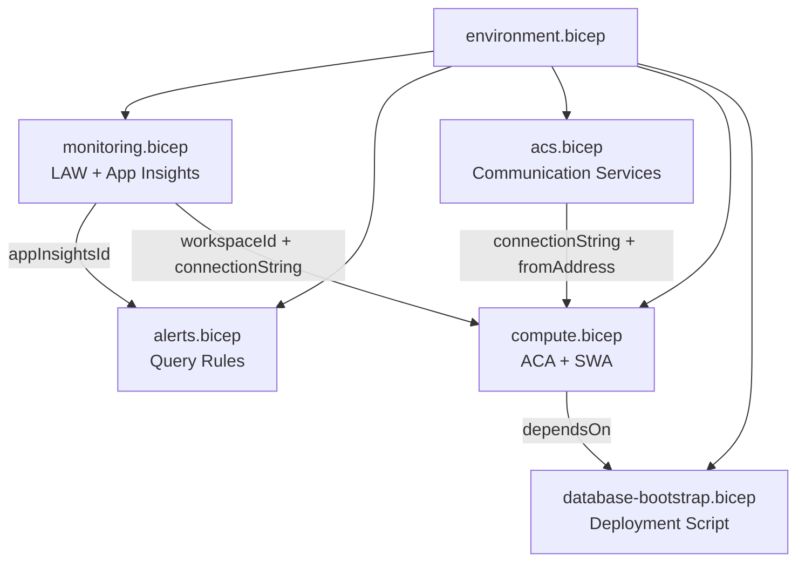
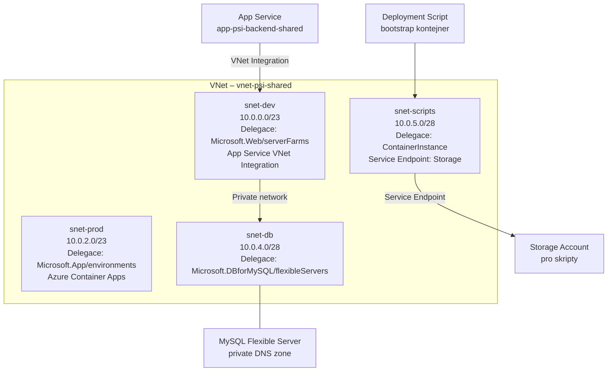
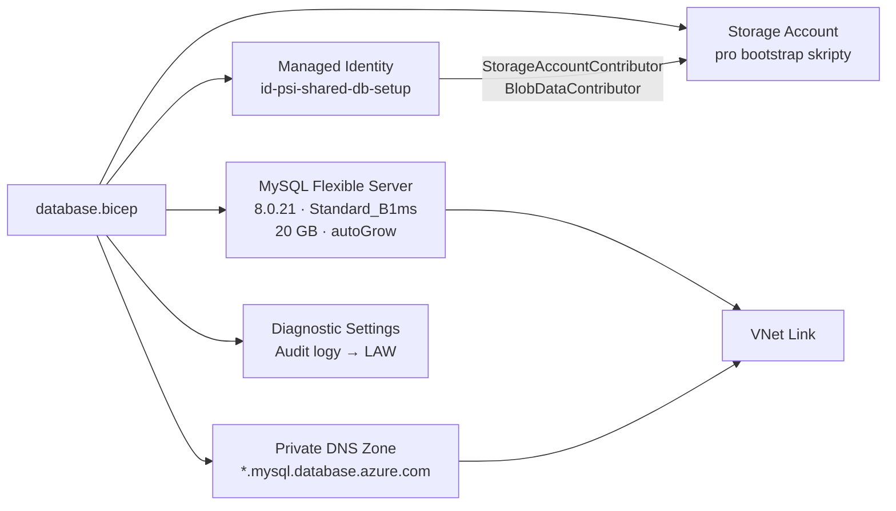
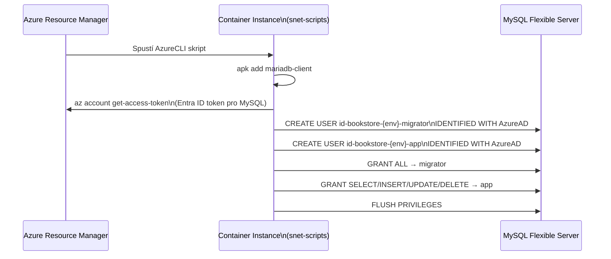

# Infrastruktura – Azure Bicep

Infrastruktura je definována jako kód pomocí **Azure Bicep**. Celá se nasazuje do resource group `rg-bookstore-shared` v regionu `polandcentral`.

---

## Struktura souborů

```
infrastructer/
├── shared.bicep          # Sdílené zdroje (ACR, VNet, DB, App Service, Storage)
├── environment.bicep     # Per-environment zdroje (ACA, SWA, monitoring, alerty)
└── modules/
    ├── acr.bicep              # Azure Container Registry
    ├── acr-role.bicep         # RBAC role assignment pro ACR Pull
    ├── acs.bicep              # Azure Communication Services (e-mail)
    ├── alerts.bicep           # Scheduled Query Rules (latence, 5xx chyby)
    ├── compute.bicep          # ACA Environment + Container App + Static Web App
    ├── database.bicep         # MySQL Flexible Server + Private DNS Zone
    ├── database-admin.bicep   # MySQL admin konfigurace
    ├── database-bootstrap.bicep # Deployment Script – Entra ID uživatelé v DB
    ├── monitoring.bicep       # Log Analytics Workspace + Application Insights
    ├── network.bicep          # VNet + subnety
    └── webapp.bicep           # App Service Plan + Web App (shared env)
```

---

## Závislosti modulů v `shared.bicep`



---

## Závislosti modulů v `environment.bicep`



---

## Azure zdroje a pojmenování

Konvence pojmenování sleduje [Azure CAF naming conventions](https://learn.microsoft.com/en-us/azure/cloud-adoption-framework/ready/azure-best-practices/resource-naming).

| Zdroj | Název (shared) | Bicep soubor |
|---|---|---|
| Resource Group | `rg-bookstore-shared` | – |
| Virtual Network | `vnet-psi-shared` | `network.bicep` |
| MySQL Flexible Server | `mysql-psi-shared` | `database.bicep` |
| Container Registry | `acrpsi<uniqueSuffix>` | `acr.bicep` |
| App Service Plan | `asp-psi-shared` | `webapp.bicep` |
| App Service (backend) | `app-psi-backend-shared` | `webapp.bicep` |
| Storage Account (frontend) | `bookstorepsi<uniqueSuffix>` | `shared.bicep` |
| Log Analytics Workspace | `law-psi-shared` | `monitoring.bicep` |
| Application Insights | `ai-psi-shared` | `monitoring.bicep` |

---

## Síťová topologie



---

## Modul: `shared.bicep`

Nasazuje **sdílené zdroje**, které jsou společné pro všechna prostředí. Spouští se GitHub Actions workflow `deploy-infra.yml`.

**Vstupní parametry:**

| Parametr | Typ | Popis |
|---|---|---|
| `prefix` | string | Předpona pro pojmenování zdrojů (výchozí: `bookstore`) |
| `location` | string | Azure region (výchozí: location resource group) |
| `administratorLoginPassword` | securestring | Heslo MySQL admina |
| `jwtSecret` | securestring | JWT signing key |

**Výstupy:**

| Výstup | Popis |
|---|---|
| `frontendUrl` | URL static website frontendu |
| `acrName` | Název Container Registry |
| `vnetId` | Resource ID VNetu |
| `dbHost` | FQDN MySQL serveru |

---

## Modul: `environment.bicep`

Nasazuje **per-environment zdroje** (dev/prod) nad sdílenou infrastrukturou. Využívá Azure Container Apps místo App Service.

**Klíčové rozdíly oproti `shared.bicep`:**

| Aspekt | `shared.bicep` | `environment.bicep` |
|---|---|---|
| Compute | App Service (B1) | Azure Container Apps (ACA) |
| Frontend | Azure Storage static website | Azure Static Web Apps (SWA) |
| Autentizace DB | password | Entra ID (Managed Identity) |
| Alerty | Ne | Ano (latence + error rate) |
| E-mail | Ne | Ano (Azure Communication Services) |

---

## Modul: `database.bicep`

MySQL Flexible Server s privátní DNS zónou pro VNet rozlišení.



**SKU:** `Standard_B1ms` (Burstable) – vhodné pro vývojové a testovací prostředí.

---

## Modul: `database-bootstrap.bicep`

Deployment Script spouštěný jako Azure CLI v kontejneru. Vytváří Entra ID uživatele v MySQL.



**Oprávnění uživatelů:**

| Identita | Databázová práva | Použití |
|---|---|---|
| `id-bookstore-{env}-migrator` | `ALL PRIVILEGES` | EF Core migrace (DDL) |
| `id-bookstore-{env}-app` | `SELECT, INSERT, UPDATE, DELETE, EXECUTE` | Běžný chod API |
| `{developerIdentityEmail}` | `ALL PRIVILEGES` | Vývojář (ruční přístup) |

---

## Modul: `compute.bicep`

Nasazuje ACA Environment, Container App pro backend a Static Web App pro frontend.

**Škálování Container App:**

```yaml
scale:
  minReplicas: 0   # scale-to-zero v nečinnosti
  maxReplicas: 3
```

Prostředky na kontejner: `0.5 vCPU / 1 Gi RAM`.

---

## Modul: `monitoring.bicep`

| Zdroj | Konfigurace |
|---|---|
| Log Analytics Workspace | Retention: 30 dní (dev), 90 dní (prod) |
| Application Insights | Workspace-based, typ `web` |

---

## Modul: `alerts.bicep`

Dva Scheduled Query Rules sledující Application Insights:

| Alert | Popis | Výchozí práh |
|---|---|---|
| High Error Rate | ≥ N 5xx chyb na endpoint v okně | 3 chyby / 5 min |
| High Latency | P95 latence překračuje práh | 1000 ms / 5 min |

Notifikace posílány přes Action Group na e-mail (`developerIdentityEmail`).
